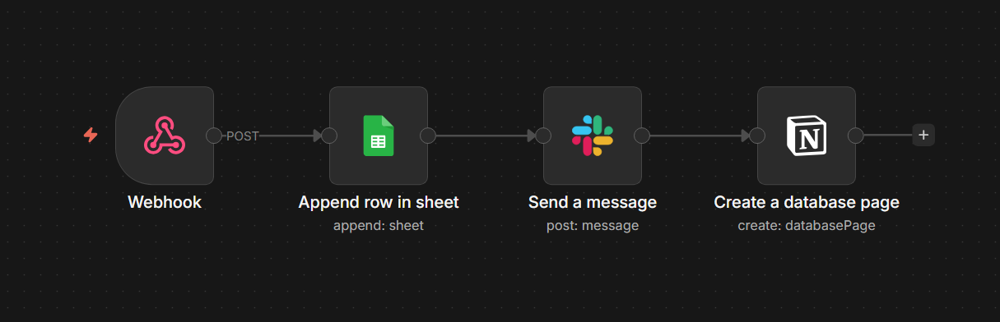
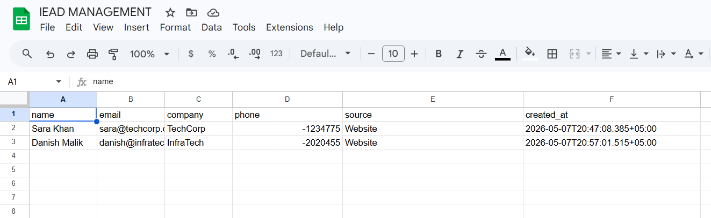
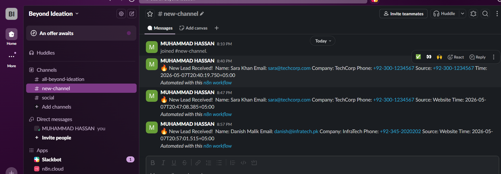
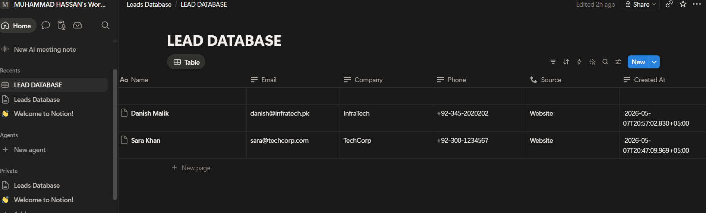

# 🚀 n8n Lead Management Automation System

Production-ready lead capture and CRM automation workflow built with n8n.

This workflow automatically captures incoming leads from a webhook, stores them in Google Sheets, sends real-time Slack notifications, and creates CRM records in Notion — eliminating manual lead handling and improving response time for sales teams.

---

# 📌 Overview

Managing leads manually can slow down sales operations and create inconsistent records across platforms.

This automation solves that problem by instantly distributing incoming leads to multiple business tools in real-time using n8n.

The workflow is designed for:
- Marketing agencies
- SaaS startups
- Sales teams
- CRM automation systems
- Client onboarding pipelines
- Contact form automation

---

# ✨ Features

- ⚡ Real-time lead processing
- 📊 Automatic Google Sheets lead logging
- 💬 Instant Slack team notifications
- 📝 Automatic Notion CRM record creation
- 🔗 Webhook-based API integration
- 🔐 Production-ready workflow structure
- 🚀 Scalable automation architecture
- 🧩 Easy workflow import into n8n

---

# 🛠️ Tech Stack

| Tool | Purpose |
|------|---------|
| **n8n** | Workflow automation engine |
| **Google Sheets** | Lead database storage |
| **Slack** | Team notifications |
| **Notion** | CRM and lead management |
| **Webhook API** | Incoming lead capture |

---

# 🔄 Workflow Architecture

```txt
Webhook Trigger
      │
      ▼
Google Sheets (Lead Database)
      │
      ▼
Slack Notification
      │
      ▼
Notion CRM Record
```

---

# 📸 Workflow Preview

## n8n Workflow


---

## Google Sheets Lead Database


---

## Slack Real-Time Alerts


---

## Notion CRM Records


---

# 💡 Business Value

This automation removes repetitive manual work by instantly distributing leads across multiple business systems.

### Benefits:
- Faster lead response time
- Centralized lead tracking
- Improved team communication
- Better CRM organization
- Reduced human error
- Fully automated workflow execution

---

# 📥 API Input Example

Send a `POST` request to the webhook endpoint:

```json
{
  "name": "Ahmed Raza",
  "email": "ahmed@company.com",
  "company": "TechPK",
  "phone": "+92-300-1234567",
  "source": "LinkedIn"
}
```

---

# 📋 Input Fields

| Field | Type | Required | Description |
|------|------|------|------|
| name | string | ✅ | Lead full name |
| email | string | ✅ | Lead email address |
| company | string | ✅ | Company name |
| phone | string | ✅ | Contact number |
| source | string | ✅ | Lead source platform |

---

# ⚙️ Setup Instructions

## 1️⃣ Import Workflow

1. Download the workflow JSON file from:
   ```txt
   /workflow/lead-management-workflow.json
   ```

2. Open n8n

3. Click:
   - Import Workflow
   - Select JSON file

---

## 2️⃣ Connect Credentials

Configure the following credentials inside n8n:

- Google Sheets OAuth2
- Slack OAuth2
- Notion OAuth2

---

## 3️⃣ Configure Google Sheets

Create a sheet with these headers:

```txt
name | email | company | phone | source | created_at
```

---

## 4️⃣ Configure Notion Database

Create database properties:

| Property | Type |
|------|------|
| Name | Title |
| Email | Text |
| Company | Text |
| Phone | Text |
| Source | Text |
| Created At | Date |

---

## 5️⃣ Connect Notion Integration

1. Open Notion Settings
2. Create new integration
3. Share database access with integration

---

## 6️⃣ Activate Workflow

- Enable workflow in n8n
- Copy production webhook URL
- Start receiving leads instantly

---

# 📊 Performance

- ✅ Tested in live environment
- ✅ Under 2 seconds processing time
- ✅ Simultaneous multi-platform updates
- ✅ 24/7 webhook automation
- ✅ Zero manual intervention

---

# 🔐 Security Recommendations

For production deployments:

- Enable Header Authentication
- Use secure API keys
- Protect webhook endpoints
- Store credentials securely
- Restrict public access where necessary

Example:

```txt
X-API-Key: your-secret-key
```

---

# 📂 Project Structure

```txt
n8n-lead-management-system/
│
├── README.md
├── LICENSE
├── .gitignore
│
├── workflow/
│   └── lead-management-workflow.json
│
├── screenshots/
│   ├── workflow-overview.png
│   ├── google-sheets-output.png
│   ├── slack-alert.png
│   └── notion-crm.png
│
├── docs/
│
└── assets/
    └── banner.png
```

---

---

# 📄 License

This project is licensed under the MIT License.

---

# 🤝 Contributing

Contributions, improvements, and feature suggestions are welcome.

Feel free to fork the repository and submit pull requests.

---

# ⭐ Support

If you found this project useful, consider starring the repository to support future automation projects.
